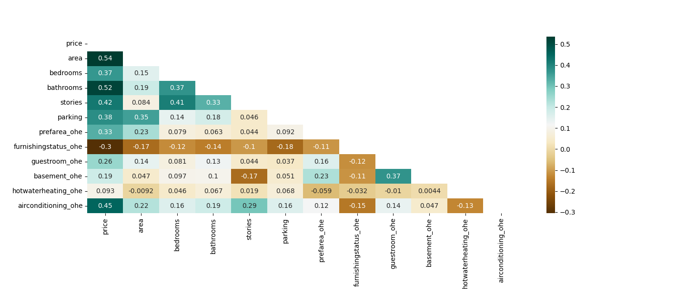
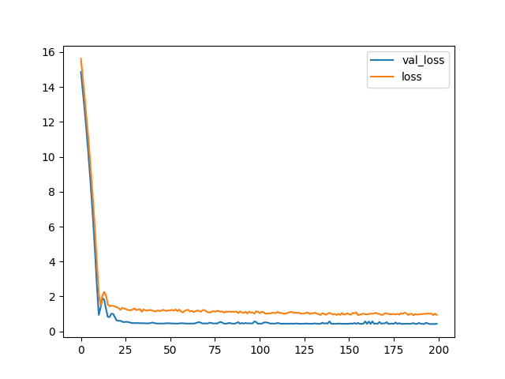

# house-price-prediction
Projeto para predição de preço de casas usando modelos de redes neurais profundas.

Foi aplicado uma rede neural de 3 camadas, utilizando variáveis relevantes de acordo com a matriz de correlação de pearson.


Ao final o modelo conseguiu uma boa taxa de aprendizagem conforme demonstra nosso gráfico de perda.


Ao tentar prever valores, ainda assim apesar de alguns estarem muito próximos da verdade, outros casos demonstraram uma diferença de 20% a 40% do valor real. Casos esses que precisam ser estudados, por possuírem características que talvez não se encaixem no modelo generalizado.

```
real_price / predict_price (diff) 6650000 / 6762936 ( 1 %)

real_price / predict_price (diff) 3709999 / 2633750 ( -29 %)

real_price / predict_price (diff) 6439999 / 4106672 ( -36 %)

real_price / predict_price (diff) 2800000 / 2929417 ( 4 %)

real_price / predict_price (diff) 4900000 / 6495162 ( 32 %)

real_price / predict_price (diff) 5250000 / 7362869 ( 40 %)

real_price / predict_price (diff) 4542999 / 5453652 ( 20 %)

real_price / predict_price (diff) 2450000 / 1469471 ( -40 %)

real_price / predict_price (diff) 3352999 / 1654593 ( -50 %)

real_price / predict_price (diff) 10149999 / 9062808 ( -10 %)

real_price / predict_price (diff) 2659999 / 2530399 ( -4 %)
```